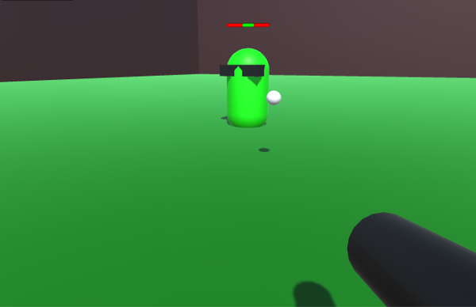

# Description

This Unity project sample was created in Unity 5.5. This sample was created following the Unity [Multiplayer Networking](https://unity3d.com/learn/tutorials/topics/multiplayer-networking) Tutorial.

The [NetworkManagerAutoMatch](https://github.com/tgraupmann/UnityNetworkingAutoMatch/blob/master/Assets/NetworkingAutoMatch/Scripts/NetworkManagerAutoMatch.cs) script will automatically join a match (if found) or create a new match at the start.

